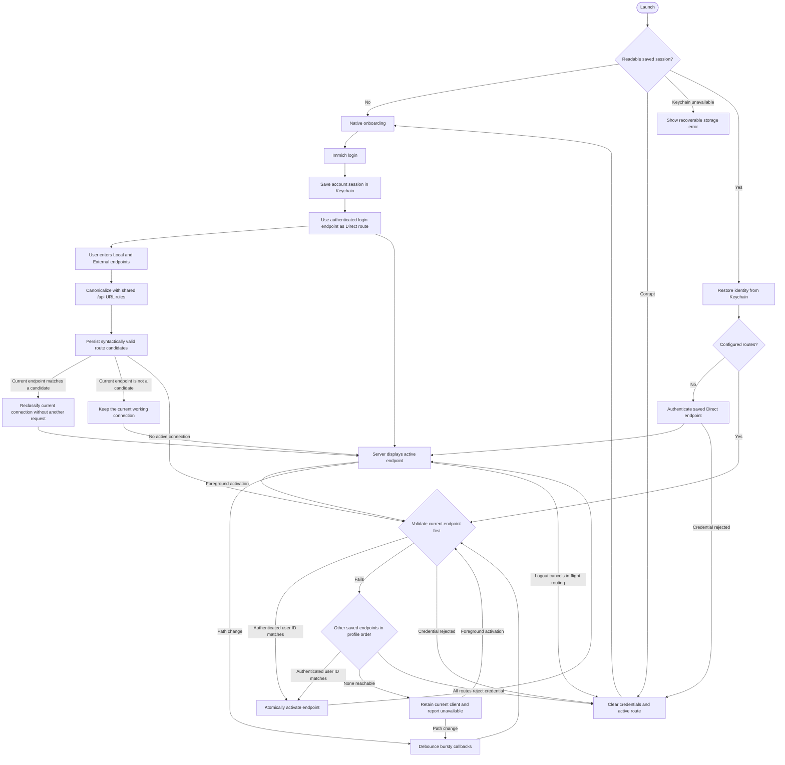

<b><font>Remmich</font></b>

A native, read-only Immich client for iPhone and iPad. Your library, with the platform feel Apple intended.

<p align="center">
  
  
  
  <a href="https://github.com/Ender-Wang/Remmich/actions/workflows/build-and-test.yml"></a>
</p>

**Why Remmich exists:** Immich is an excellent self-hosted photo library, but its official mobile app is built with Flutter. Remmich explores a focused alternative: native SwiftUI navigation, adaptive iPad layouts, system materials, and Apple-platform interaction patterns while keeping the Immich library strictly read-only.

Remmich never creates, edits, archives, favorites, or deletes server content. Save to Photos, Share, and Download are allowed because they act on the Apple device, not the Immich server.

# Milestones

Each milestone is a small, testable step toward a native, read-only Immich client. The detailed execution plan is maintained alongside this repository in `immich-docs`.

| Milestone | Status | What it delivers |
| --- | --- | --- |
| M0 | ✅ Done | Reproducible Xcode project, formatting, and baseline configuration |
| M1 | ✅ Done | Adaptive native Photos, Albums, Library, and Search shell using fixtures |
| M2 | ✅ Done | Secure login, Keychain restoration, verified endpoint failover, and typed read-only API boundary |
| M3 | ⏳ Pending | Shared image loading, memory management, prefetching, and download infrastructure |
| M4 | Planned | Real server-backed Photos timeline |
| M5 | Planned | Native viewer with Save to Photos, Share, and Download |
| M6 | Planned | Read-only Albums browsing |
| M7 | Planned | Read-only Library collections |
| M8 | Planned | Search with native filters |
| M9 | Planned | iPad, Liquid Glass, accessibility, resilience, and performance polish |
| M10 | Planned | Real-device verification and AltStore release candidate |

# Current state — M2 complete

This is the single living state diagram for the implemented app. It is updated when each milestone finishes.



# Development

Refresh the pinned schema from a sibling Immich checkout without embedding a developer path:

```bash
Scripts/update-immich-schema.sh
```

Or pass a schema path explicitly:

```bash
Scripts/update-immich-schema.sh path/to/immich-openapi-specs.json
```

The updater prints a repository-relative checksum target. Schema provenance and the pinned upstream revision live in `Packages/ImmichAPI/SCHEMA-PROVENANCE.md`.

The project uses SwiftFormat as a pre-build check. Xcode may ask you once to trust the pinned Swift OpenAPI Generator build-tool plugin.

GitHub Actions runs formatting, package tests, app unit tests, and simulator UI tests for every pushed commit and pull request. It can also be started manually from the Actions tab.

True SSID matching requires the `com.apple.developer.networking.wifi-info` entitlement, which Apple does not provision for personal development teams. `Remmich/Remmich.entitlements` records the paid-team capability, but the personal-signing target intentionally does not attach it. Correctness does not depend on SSID: Personal Team builds validate the endpoint currently in use first, then the other saved endpoints in profile order, using one bounded authenticated `/users/me` identity check per candidate. Bursty path changes are debounced, stale evaluations cannot publish route state, and Remmich never substitutes `localhost`.
